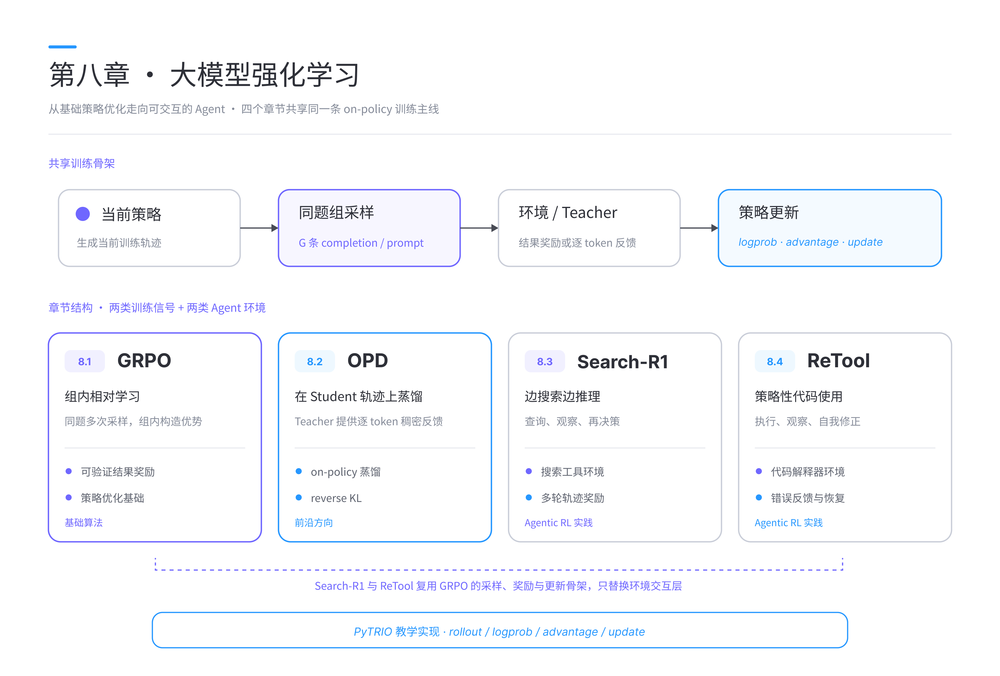
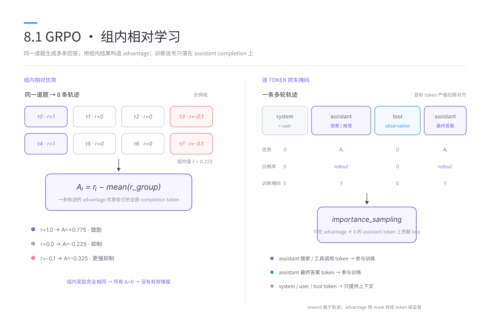
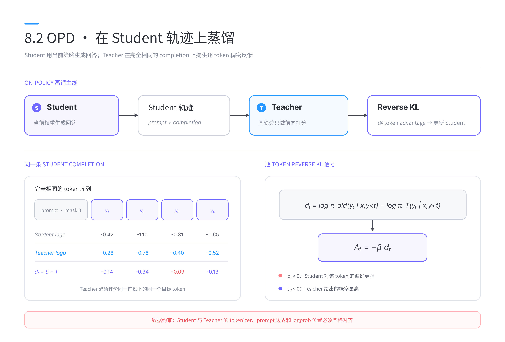
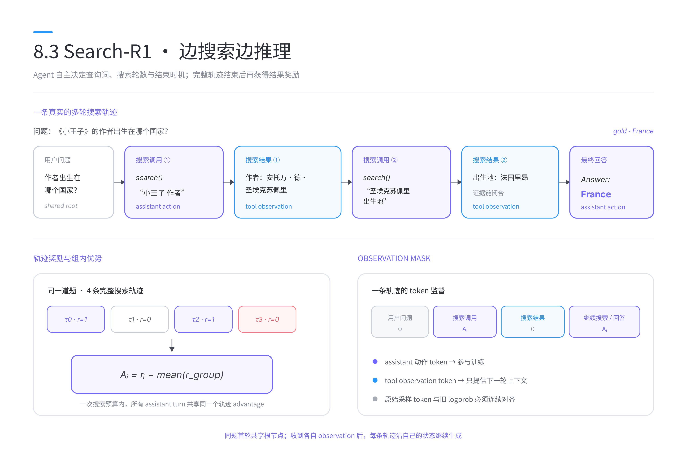
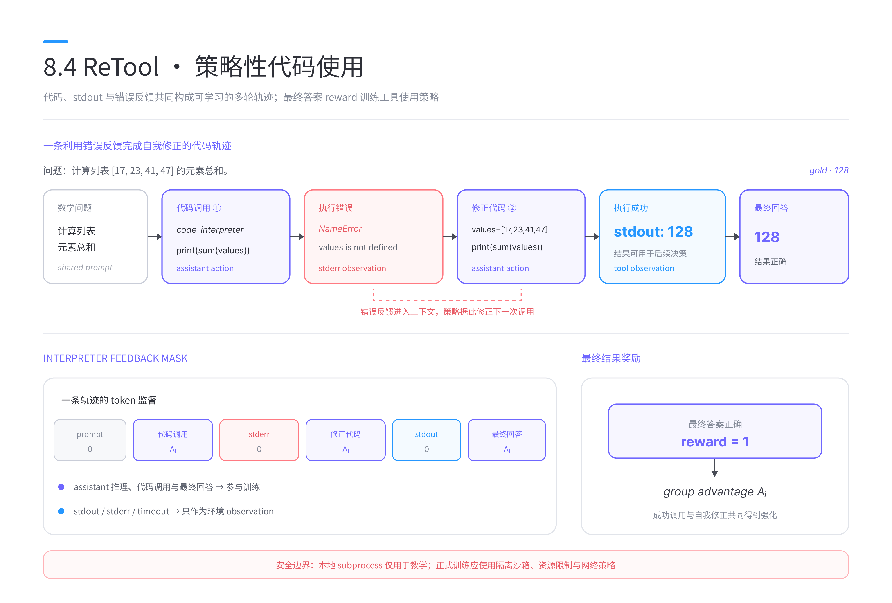

# 第八章 大模型强化学习

在第四章中，我们从人类反馈强化学习（Reinforcement Learning from Human Feedback，RLHF）出发，介绍了奖励模型、近端策略优化（Proximal Policy Optimization，PPO）以及指令对齐的基本流程。第六章进一步给出了大模型训练的工程基础，第七章则让模型拥有了规划、记忆与调用工具的能力。

当 Agent 真正进入搜索、代码执行等环境后，仅靠监督微调已经很难覆盖所有可能的交互轨迹。模型需要自己尝试动作，根据最终结果判断一条轨迹是否有效，再把成功经验更新到策略中。大模型强化学习由此从“让回答更符合偏好”，逐步走向“让模型在环境中学会行动”。

本章围绕四个彼此衔接的主题展开。首先介绍当前大模型强化学习中使用广泛的 Group Relative Policy Optimization（GRPO），建立 rollout、reward、advantage 与策略更新的完整认识；随后介绍 On-Policy Distillation（OPD），观察 Student 如何在自己的状态分布上持续获得 Teacher 的逐 token 指导；最后以 Search-R1 和 ReTool 为例，把同一套训练框架扩展到搜索引擎与代码解释器，完成两条可以运行的 Agentic RL 实践。

<div align='center'>
    
    <p>图 8.1 第八章内容结构</p>
</div>

本章全部示例均使用 PyTRIO 0.2.6。PyTRIO 将本地的数据处理、环境交互和训练控制，与远端的模型采样、前向反向传播和权重管理连接起来。四个示例虽然任务不同，核心链路始终可以概括为：

1. 使用当前策略生成一条或一组轨迹；
2. 根据结果或 Teacher 反馈计算训练信号；
3. 将 prompt、response、旧策略 logprob 和 advantage 对齐为 `Datum`；
4. 调用 `forward_backward()` 与 `optim_step()` 更新策略；
5. 刷新采样客户端，让下一轮 rollout 使用新权重。

配套代码位于 `docs/chapter8`。从仓库根目录安装公共依赖：

```bash
uv venv --python 3.13
source .venv/bin/activate
uv pip install -r docs/chapter8/requirements.txt
trio login
```

PyTRIO 服务支持的模型会持续更新，正式实验前可以使用下面的代码查看当前列表：

```python
import pytrio as trio

service_client = trio.ServiceClient()
print(service_client.get_supported_models())
```

> **扩展阅读：** 如果你希望继续了解更多 Agentic RL 算法与可运行实践，可以阅读作者维护的另一个开源项目 [agentic-rl-lab](https://github.com/KMnO4-zx/agentic-rl-lab)。除本章介绍的内容外，该仓库还包含 OPSD、DAPO、GSPO、ALFWorld 等算法与环境的原理拆解、训练代码和实验记录。

> 注：作者选择 PyTrio 而不是 Verl 作为本章示例，意在希望降低 Agentic RL 的工程门槛与实验成本。按照文中的最小试跑配置，作者力争将四个示例的基础实验预算控制在 200 元以内，让读者亲手跑通 rollout、reward、advantage 与策略更新闭环。实际费用会随模型、采样长度、训练步数和评测规模变化。

## 8.1 GRPO

GRPO 最早在 DeepSeekMath 中被系统提出。它保留了 PPO 的 on-policy 更新思想，同时使用同一道题的一组采样结果估计相对优势，从而省去单独训练 Value Model 的过程。对于具有可验证答案的数学、代码和逻辑任务，这种方法能够直接利用结果奖励，已经成为大模型强化学习最常见的基础算法之一。

### 8.1.1 从语言模型到强化学习策略

自回归语言模型接收 prompt $x$，并依次生成 token 序列 $y=(y_1,y_2,\ldots,y_T)$。从概率建模的角度看，完整回答的概率可以写为：

$$\pi_\theta(y\mid x) = \prod_{t=1}^{T} \pi_\theta(y_t\mid x,y_{\lt t}),$$

其中， $\pi_\theta$ 表示参数为 $\theta$ 的语言模型策略。将语言模型放入强化学习框架后，可以得到表 8.1 所示的对应关系。

| 强化学习概念 | 大语言模型中的含义 |
| --- | --- |
| 状态 $s_t$ | prompt 与已经生成的 token |
| 动作 $a_t$ | 下一个 token |
| 策略 $\pi_\theta(a_t\mid s_t)$ | 模型对下一个 token 的概率分布 |
| 轨迹 $\tau$ | 一段完整回答，或包含工具调用的多轮交互 |
| 环境 | 数据集判题器、搜索引擎、代码解释器等 |
| 奖励 $R(\tau)$ | 答案正确性、格式、工具执行结果等反馈 |

一次模型生成通常称为一次 rollout。训练的目标，是提高高奖励轨迹中动作出现的概率，同时降低低奖励轨迹中动作出现的概率。最直观的策略梯度形式为：

$$\nabla_\theta J(\theta) = \mathbb{E}_{\tau\sim\pi_\theta} \left[ A(\tau) \nabla_\theta \log \pi_\theta(\tau) \right],$$

其中， $A(\tau)$ 是优势函数。优势为正，说明这条轨迹相对值得鼓励；优势为负，说明当前策略需要减少类似行为。

大模型的动作空间是整个词表，一段回答又可能包含数百到数千个 token。训练时还要控制新旧策略的变化幅度，防止一次更新破坏模型已有能力。因此，真正困难的部分通常集中在两个问题上：如何得到稳定的 advantage，以及如何安全地使用这些 advantage 更新策略。

### 8.1.2 从 PPO 到 GRPO

PPO 通常使用一个 Value Model 估计状态价值 $V_\phi(s_t)$，再结合回报计算 advantage。大模型场景中的 Value Model 往往与策略模型规模接近，它会带来额外的显存、训练和同步成本。价值估计误差也会进一步传递到策略更新。

GRPO 改用组内相对比较。对于一个问题 $x$，先从旧策略 $\pi_{\theta_{\mathrm{old}}}$ 中采样 $G$ 个回答：

$$\{y_1,y_2,\ldots,y_G\} \sim \pi_{\theta_{\mathrm{old}}}(\cdot\mid x).$$

判题器分别给出奖励 $r_1,r_2,\ldots,r_G$。经典 GRPO 使用组内均值和标准差对奖励进行标准化：

$$A_i = \frac{r_i-\mathrm{mean}(r_1,\ldots,r_G)}{\mathrm{std}(r_1,\ldots,r_G)+\varepsilon}.$$

这样一来，同一道题中的高分回答获得正 advantage，低分回答获得负 advantage。问题本身的难度被组内基线抵消，策略可以更专注地学习“在相同条件下，哪些生成方式更好”。

<div align='center'>
    
    <p>图 8.2 GRPO 的分组采样与策略更新</p>
</div>

例如，对同一道数学题采样 4 个回答，规则判题器得到奖励 $[1,0,0,1]$。组内均值为 $0.5$，只做均值中心化时，4 个 advantage 分别为：

$$[0.5,-0.5,-0.5,0.5].$$

两个正确回答会被鼓励，两个错误回答会被抑制。本章代码为了直接展示组内基线，默认采用：

$$A_i=r_i-\bar r.$$

完整实验也可以加入标准差归一化。两种写法表达了相同的组内相对思想，但梯度尺度不同，比较实验时应固定 advantage 的计算方式。

这里还有一个容易忽略的退化情形。当一组回答全部正确，或者全部错误时，每个 $A_i$ 都等于 0，这组数据不会产生有效策略梯度。若训练日志中退化组比例长期很高，通常需要调整题目难度、采样温度、基础模型能力或 group size。

### 8.1.3 奖励与可验证强化学习

GRPO 只负责把组内奖励转换为相对优势，奖励质量仍然决定了模型最终学到什么。数学和代码任务通常能够使用确定性的规则判题器，这类训练也被称为 Reinforcement Learning with Verifiable Rewards（RLVR）。

本章以 GSM8K 为例，要求模型将最终数值写在 `\boxed{}` 中。最小判题逻辑如下：

```python
def extract_boxed(text: str) -> str | None:
    marker = r"\boxed{"
    start = text.rfind(marker)
    if start < 0:
        return None
    end = text.find("}", start + len(marker))
    if end < 0:
        return None
    return text[start + len(marker):end].strip()


def grade_answer(response: str, ground_truth: str) -> float:
    prediction = extract_boxed(response)
    if prediction is None:
        return 0.0
    return float(normalize_answer(prediction) == normalize_answer(ground_truth))
```

规则奖励简单、便宜，并且可以重复计算。不过，规则一旦存在漏洞，模型就可能学习利用漏洞获得高分。设计 reward 时应至少检查以下内容：

- **答案抽取是否稳健**：同一个正确答案可能出现整数、小数、分数或带逗号数字等形式；
- **格式奖励是否压过正确性**：格式只能作为辅助约束，不能让格式正确的错误答案获得主要奖励；
- **参考答案是否可靠**：错误标签会给模型提供方向相反的训练信号；
- **判题器是否泄露信息**：模型不应通过 prompt 或工具输出直接读到标准答案；
- **奖励是否具有区分度**：大量全 0 或全 1 的组都会让 GRPO 失去相对比较信号。

正式训练前，可以先把基础模型 rollout 保存下来，离线人工检查一批“回答—抽取结果—reward”三元组。这个步骤往往比直接调学习率更早发现问题。

### 8.1.4 策略比率与更新损失

rollout 由旧策略生成，参数更新发生在当前策略上。对第 $i$ 条回答的第 $t$ 个 token，定义新旧策略概率比：

$$\rho_{i,t}(\theta) = \frac{\pi_\theta(y_{i,t}\mid x,y_{i,\lt t})}{\pi_{\theta_{\mathrm{old}}}(y_{i,t}\mid x,y_{i,\lt t})} = \exp\left(\log\pi_\theta-\log\pi_{\theta_{\mathrm{old}}}\right).$$

最直接的 importance sampling 目标可以写为：

$$J_{\mathrm{IS}}(\theta) = \mathbb{E}_{i,t} \left[\rho_{i,t}(\theta)A_i\right].$$

如果概率比偏离 1 太远，少数 token 可能主导梯度。PPO 使用截断目标限制单次更新幅度：

$$J_{\mathrm{PPO}}(\theta) = \mathbb{E}_{i,t} \left[\min\left(\rho_{i,t}A_i, \mathrm{clip}(\rho_{i,t},1-\epsilon,1+\epsilon)A_i\right)\right].$$

DeepSeekMath 中的经典 GRPO 目标采用了 PPO 风格的 clipping，并加入与参考策略之间的 KL 约束。本章的 `train.py` 默认选择 PyTRIO 内置的 `importance_sampling`，便于观察 `old_logprobs`、`advantages` 和当前策略之间的数据关系；将命令行参数改为 `--loss-fn ppo`，即可使用内置 PPO loss。代码还保留了 CISPO 作为扩展实验。

因此，GRPO 与 PPO 需要放在不同层次理解：

- GRPO 描述如何对同题分组采样，并由组内奖励得到 advantage；
- importance sampling、PPO 或 CISPO 描述如何把 advantage 转换为可控的策略梯度。

### 8.1.5 使用 PyTRIO 实现 GRPO

接下来按照配套代码的执行顺序，串联一轮完整训练。

首先，创建 LoRA 训练客户端。训练客户端持有可更新权重，采样客户端负责 rollout：

```python
service_client = trio.ServiceClient()
training_client = service_client.create_lora_training_client(
    base_model=config.base_model,
    rank=config.lora_rank,
    seed=config.seed,
)
sampler = training_client.save_weights_and_get_sampling_client()
```

每道题需要从同一个 prompt 采样一组回答。PyTRIO 的 `sample()` 会同时返回 token 和 rollout 时对应的 logprob：

```python
sample_result = sampler.sample(
    prompt=trio.ModelInput.from_ints(prompt_tokens),
    num_samples=config.group_size,
    sampling_params=trio.SamplingParams(
        max_tokens=config.max_tokens,
        temperature=config.temperature,
        stop=stop_sequences,
    ),
).result()
```

随后计算 reward 和组内 advantage：

```python
rewards = [
    grade_answer(tokenizer.decode(sequence.tokens), ground_truth)
    for sequence in sample_result.sequences
]
reward_mean = float(np.mean(rewards))
advantages = [reward - reward_mean for reward in rewards]
```

训练数据需要严格遵守自回归右移。假设完整 token 序列为：

$$z=[x_1,\ldots,x_m,y_1,\ldots,y_T],$$

模型输入为 `z[:-1]`，监督目标为 `z[1:]`。prompt 只提供上下文，不应进入策略 loss，因此 prompt 对应位置的 advantage 和旧 logprob 都设为 0：

```python
tokens = prompt_tokens + sample.completion_tokens
input_ids = tokens[:-1]
target_ids = tokens[1:]

completion_start = len(prompt_tokens) - 1
old_logprobs = [0.0] * completion_start + sample.old_logprobs
advantages = [0.0] * completion_start + [
    sample.advantage
] * len(sample.completion_tokens)

datum = trio.Datum(
    model_input=trio.ModelInput.from_ints(input_ids),
    loss_fn_inputs={
        "target_tokens": trio.TensorData.from_ints(target_ids),
        "logprobs": trio.TensorData.from_floats(old_logprobs),
        "advantages": trio.TensorData.from_floats(advantages),
    },
)
```

这里的三个数组必须长度相同，并与 `model_input` 一一对齐：

- `target_tokens`：当前位置需要预测的下一个 token；
- `logprobs`：rollout 时旧策略对目标 token 的 logprob；
- `advantages`：每个目标 token 对应的训练权重。

最后，完成前向反向传播和优化：

```python
training_client.forward_backward(
    datums,
    loss_fn=config.loss_fn,
).result()

training_client.optim_step(
    trio.AdamParams(learning_rate=config.learning_rate)
).result()

sampler = training_client.save_weights_and_get_sampling_client()
```

最后一行非常重要。on-policy 训练要求后续轨迹来自当前策略。如果优化之后仍然使用旧采样客户端，rollout 策略与训练策略会逐步偏离，概率比和训练稳定性都会受到影响。

### 8.1.6 运行与观察训练

配套代码位于 `docs/chapter8/grpo/train.py`。下面的命令只运行一步，适合确认账号、模型、数据和日志链路：

```bash
python docs/chapter8/grpo/train.py \
    --steps 1 \
    --batch-size 1 \
    --group-size 4 \
    --max-tokens 512 \
    --loss-fn importance_sampling \
    --swanlab-mode disabled
```

正式实验应增加训练步数与 batch size，并保持数据顺序、采样温度和 group size 一致后再比较不同 loss。训练过程中建议重点观察：

| 指标 | 含义 | 异常现象 |
| --- | --- | --- |
| reward mean | 当前 batch 的平均正确率 | 长期不升可能是奖励、数据或学习率有问题 |
| reward std | 同组回答的差异 | 长期接近 0 表示相对信号不足 |
| degenerate group ratio | 全对或全错的组占比 | 过高时有效训练组太少 |
| response length | 回答 token 数 | 突然增长可能出现冗长推理或截断 |
| probability ratio / KL | 新旧策略偏移 | 快速增大通常意味着更新过强 |
| train token count | 实际参与 loss 的 token 数 | 为 0 时应先检查 mask 和 advantage |

至此，我们得到了本章的第一条训练主线：当前策略分组采样，规则环境给出结果奖励，组内比较产生 advantage，PyTRIO 完成策略更新。接下来的 OPD 会保留同样的 on-policy 数据流，同时把训练信号换成 Teacher 对每个 token 的反馈。

## 8.2 On-Policy Distillation

大模型能力蒸馏通常由一个较强的 Teacher 和一个较小的 Student 组成。传统知识蒸馏使用预先收集好的数据，让 Student 拟合 Teacher 在这些固定样本上的概率分布。随着 Student 在训练中不断变化，固定数据与 Student 真正会访问的状态之间可能出现偏差。

On-Policy Distillation（OPD）让 Student 使用当前策略生成回答，再由 Teacher 对 Student 已经走过的轨迹逐 token 打分。这样，每一轮监督都位于 Student 当前的状态分布上。Teacher 无需重新生成一套答案，也无需参与反向传播，它只为 Student 的动作提供稠密概率反馈。

OPD 近年逐渐成为大模型训练中的重要方向。它可以用于推理能力迁移、能力恢复以及持续学习，还能够与强化学习的数据流自然结合：Student rollout 对应 on-policy 轨迹，Teacher logprob 对应逐 token 训练信号，Student 更新后再生成下一批轨迹。

### 8.2.1 从离线蒸馏到 On-Policy Distillation

设 Teacher 为 $\pi_T$，Student 为 $\pi_\theta$。离线蒸馏先固定一个数据集 $\mathcal D$，然后在其中的状态上最小化分布差异：

$$\mathcal L_{\mathrm{offline}} = \mathbb E_{s\sim\mathcal D} \left[D\bigl(\pi_T(\cdot\mid s),\pi_\theta(\cdot\mid s)\bigr)\right].$$

这种做法实现简单，效果取决于数据集能否覆盖 Student 推理时遇到的状态。假设固定数据中大多是 Teacher 的高质量轨迹，而 Student 在真实生成时较早出现了一个错误 token，它随后进入的状态可能从未出现在蒸馏数据中，Teacher 的指导便无法覆盖这段分布外轨迹。

OPD 把状态采样改为当前 Student：

$$y\sim\pi_{\theta_{\mathrm{old}}}(\cdot\mid x),$$

然后让 Teacher 计算同一条 Student completion 的条件概率：

$$\log\pi_T(y_t\mid x,y_{\lt t}).$$

一次训练迭代可以分为三步：

1. **Student rollout**：Student 使用当前权重生成回答；
2. **Teacher feedback**：Teacher 在完全相同的 prompt 与 completion 上计算 logprob；
3. **Student update**：根据两者的概率差构造逐 token 信号并更新 Student。

<div align='center'>
    
    <p>图 8.3 OPD 在 Student 自身轨迹上获得 Teacher 反馈</p>
</div>

图 8.3 中，Teacher 只进行前向计算。Student 的采样动作也不参与反向传播，梯度从构造好的训练目标回到当前 Student 参数。这种停止梯度的边界使 OPD 可以直接复用现有 rollout 与策略优化基础设施。

### 8.2.2 Reverse KL 与逐 token 训练信号

OPD 可以选择不同的分布散度。本章使用 reverse KL：

$$D_{\mathrm{KL}}\left(\pi_\theta\,\|\,\pi_T\right) = \mathbb E_{y\sim\pi_\theta} \left[\log\pi_\theta(y\mid x)-\log\pi_T(y\mid x)\right].$$

对于 Student 实际采样到的第 $t$ 个 token，可以得到一个 Monte Carlo 估计：

$$d_t = \log\pi_{\theta_{\mathrm{old}}}(y_t\mid x,y_{\lt t})-\log\pi_T(y_t\mid x,y_{\lt t}).$$

当 $d_t>0$ 时，Student 对这个 token 的偏好高于 Teacher；当 $d_t<0$ 时，Teacher 给出的概率更高。为了最小化 reverse KL，本章将训练 advantage 写为：

$$A_t=-\beta d_t,$$

其中， $\beta$ 控制蒸馏强度。这样，每个 completion token 都能获得独立的训练信号，信号密度远高于只在回答结束时给出一个 0/1 reward。

reverse KL 具有较强的 mode-seeking 特性。Student 会优先集中到 Teacher 已经赋予较高概率的区域，适合将 Teacher 的高置信行为压缩到小模型中。与此同时，Teacher 与 Student 的能力差距、推理风格和 tokenizer 兼容性都会影响蒸馏效果。更大的 Teacher 只是候选条件，Teacher 还需要在 Student 当前轨迹上提供有价值且可学习的新信号。

表 8.2 对比了 GRPO 与本章 OPD 示例的数据来源。

| 项目 | GRPO | OPD |
| --- | --- | --- |
| 轨迹来源 | 当前策略 | 当前 Student |
| 反馈来源 | 环境或规则判题器 | Teacher 概率分布 |
| 信号粒度 | 常见为整条轨迹 reward | 逐 completion token |
| 是否需要标准答案 | 通常需要可验证结果 | prompt-only 数据即可 |
| 是否需要额外模型 | 可省去 Value Model | 需要 Teacher 前向计算 |
| 主要风险 | reward hacking、退化组 | Teacher 不兼容、能力差距不合适 |

### 8.2.3 Teacher 必须评价同一条 Student 轨迹

OPD 的关键数据约束，是 Teacher 与 Student 必须在相同前缀下评价相同目标 token。Teacher 自己生成一条回答，再让 Student 学习这条回答，会退回到常见的合成数据蒸馏流程。

在 PyTRIO 中，可以先把 prompt 和 Student completion 拼接起来，再调用 Teacher 的 `compute_logprobs()`：

```python
def completion_teacher_logprobs(
    teacher_client,
    prompt_ids: list[int],
    completion_ids: list[int],
):
    all_ids = prompt_ids + completion_ids
    all_logprobs = teacher_client.compute_logprobs(
        trio.ModelInput.from_ints(all_ids)
    ).result()

    start = len(prompt_ids)
    end = start + len(completion_ids)
    return [float(x) for x in all_logprobs[start:end]]
```

不同 SDK 对 logprob 的位置定义可能存在一位偏移，因此不能仅凭数组长度猜测切片。最稳妥的方法是构造一个很短的已知序列，确认返回值中每个位置究竟表示“当前 token 的 logprob”还是“下一个 token 的 logprob”，再完成 prompt 与 completion 的边界测试。本章代码已经按照 PyTRIO 0.2.6 的返回约定完成对齐。

Teacher 和 Student 还需要共享可兼容的 tokenizer。若同一组 token id 在两个模型中代表不同字符串，即使数组长度相同，概率差也没有正确语义。正式训练前应验证：

```python
text = "A short tokenizer alignment test."
student_ids = student_tokenizer.encode(text, add_special_tokens=False)
teacher_ids = teacher_tokenizer.encode(text, add_special_tokens=False)

assert student_ids == teacher_ids
```

对于同系列但 chat template 不同的模型，应由 Student tokenizer 渲染一次完整 prompt，然后让 Teacher 直接评价对应 token 序列。不要分别套用两份 chat template，否则两边看到的上下文已经发生变化。

### 8.2.4 使用 PyTRIO 实现 OPD

首先创建可训练的 Student 和只读的 Teacher：

```python
service_client = trio.ServiceClient()

training_client = service_client.create_lora_training_client(
    base_model=args.base_model,
    rank=args.lora_rank,
    seed=args.seed,
)

teacher_client = service_client.create_sampling_client(
    base_model=args.teacher_base_model,
    model_path=args.teacher_model_path,
)
```

每一步开始时，从最新 Student 权重创建采样客户端：

```python
student_sampler = (
    training_client.save_weights_and_get_sampling_client()
)

result = student_sampler.sample(
    prompt=trio.ModelInput.from_ints(prompt_ids),
    num_samples=args.group_size,
    sampling_params=sampling_params,
    return_text=False,
).result()
```

这里的 `group_size` 表示同一个 prompt 生成多少条 Student 轨迹。OPD 不依赖 GRPO 的组内均值，每条轨迹都可以独立得到逐 token Teacher 信号。增加采样数能够扩大 Student 状态覆盖范围，也会线性增加 Teacher 打分开销。

接下来，对每条 Student completion 计算 reverse KL：

```python
student_lps = np.asarray(sequence.logprobs, dtype=np.float32)
teacher_lps = np.asarray(
    completion_teacher_logprobs(
        teacher_client,
        prompt_ids,
        sequence.tokens,
    ),
    dtype=np.float32,
)

reverse_kl = student_lps - teacher_lps
advantages = -args.kl_penalty_coef * reverse_kl
```

最后，将 prompt 区域 mask 掉，并使用 importance sampling 更新 Student：

```python
datum = build_opd_datum(
    prompt_ids=prompt_ids,
    completion_ids=sequence.tokens,
    old_logprobs=student_lps.tolist(),
    advantages=advantages.tolist(),
)

training_client.forward_backward(
    [datum],
    loss_fn="importance_sampling",
).result()
training_client.optim_step(adam).result()
```

从代码结构上看，GRPO 和 OPD 的更新接口几乎相同。两者真正的区别发生在 advantage 生成阶段：

```python
# GRPO：整条回答共享组内相对优势
advantage = reward - group_reward_mean

# OPD：每个 token 使用 Student 与 Teacher 的概率差
advantage_t = -beta * (
    student_logprob_t - teacher_logprob_t
)
```

这说明 PyTRIO 的 `Datum` 可以看作统一的策略学习接口。上游可以接规则奖励、Teacher 概率、奖励模型或工具环境，下游仍然使用同一套 token 对齐和优化逻辑。

### 8.2.5 运行与分析 OPD

本章使用 DeepMath-103K 作为 prompt pool，只读取问题文本，不使用数据集中的标准推理过程。最小试跑命令如下：

```bash
python docs/chapter8/opd/train.py \
    --steps 1 \
    --batch-size 1 \
    --group-size 1 \
    --max-tokens 512 \
    --sample-size 20 \
    --num-shards 1 \
    --swanlab-mode disabled
```

示例默认使用 `Qwen/Qwen3.5-4B` 作为 Student，使用 `Qwen/Qwen3.6-27B` 作为 Teacher。可用模型应以当前 PyTRIO 服务返回的支持列表为准。训练时建议同步记录：

- `opd/reverse_kl_mean`：Student 采样分布与 Teacher 的平均差异；
- `opd/reverse_kl_std`：不同 token 蒸馏信号的离散程度；
- `completion_tokens_total`：每步实际完成 Teacher 打分的 token 总量；
- 任务评测指标：例如数学准确率或代码通过率；
- 通用能力回归指标：检查蒸馏是否牺牲了原有能力。

reverse KL 下降只能说明 Student 更接近 Teacher，不能单独证明任务能力提升。完整实验应在固定题集上比较训练前后的正确率，并保留不参与训练的通用评测集。

若训练很快出现 loss 波动或能力下降，可以依次检查：

1. Teacher 与 Student token 是否严格对齐；
2. Teacher 是否在 Student 当前轨迹上表现得更可靠；
3. `kl_penalty_coef` 与学习率是否过大；
4. Student sampler 是否按计划刷新；
5. completion 是否频繁被 `max_tokens` 截断。

GRPO 和 OPD 到这里都发生在“模型生成一段回答，外部模块提供训练信号”的单轮结构中。Agentic RL 会进一步改变轨迹形态：模型在完成回答前可以暂停生成、调用环境、读取 observation，再继续决定下一步动作。

## 8.3 Search-R1

大语言模型内部存储了大量知识，但这些知识受训练数据时间范围、参数容量和长尾覆盖率限制。检索增强生成（Retrieval-Augmented Generation，RAG）通常由系统预先检索文档，再把结果交给模型回答。Search-R1 将搜索决策交给模型：模型可以判断何时搜索、搜索什么、是否需要根据新证据继续搜索，以及何时结束并给出答案。

这项变化使一次回答成为多轮轨迹：

$$\tau=(x,a_1,o_1,a_2,o_2,\ldots,a_T),$$

其中， $a_t$ 是模型生成的搜索调用或最终回答， $o_t$ 是搜索环境返回的 observation。模型只有在完成整条轨迹后才能获得结果奖励，GRPO 再把成功搜索路径与失败路径区分开。

### 8.3.1 从固定检索到自主搜索

固定 RAG 与 Search Agent 的差异可以从表 8.3 中看出。

| 环节 | 固定 RAG | Search-R1 |
| --- | --- | --- |
| 是否检索 | 由外部流程决定 | 模型根据当前状态决定 |
| 检索词 | 预设或单次生成 | 可根据 observation 多次改写 |
| 检索轮数 | 通常固定 | 由策略决定，受最大次数约束 |
| 训练对象 | 回答模型或检索器 | 搜索动作与最终回答的统一策略 |
| 奖励 | 常见为监督答案 loss | 完整轨迹的结果奖励 |

例如，问题“《小王子》的作者出生在哪个国家？”需要先确定作者，再查询作者的出生地。模型可以形成下面的轨迹：

```text
User: What country was the author of The Little Prince born in?

Assistant -> search("The Little Prince author")
Tool: Antoine de Saint-Exupéry ...

Assistant -> search("Antoine de Saint-Exupéry birthplace country")
Tool: He was born in Lyon, France ...

Assistant: Answer: France
```

第二次搜索词依赖第一次 observation，因此无法在 rollout 开始前一次性确定。训练代码需要维护环境状态，并在每个 assistant turn 后解析模型动作。

<div align='center'>
    
    <p>图 8.4 Search-R1 的多轮搜索与 observation mask</p>
</div>

Search-R1 论文使用 `<search>... </search>` 和 `<information>... </information>` 等文本标签表示动作与观察。本章面向 Qwen3.5，采用模型原生 function calling 模板：

```python
SEARCH_TOOL = {
    "type": "function",
    "function": {
        "name": "search",
        "description": "Search the web for evidence.",
        "parameters": {
            "type": "object",
            "properties": {
                "query": {"type": "string"},
            },
            "required": ["query"],
        },
    },
}
```

两种协议承载相同的强化学习语义：Assistant 输出可训练动作，搜索后端返回环境 observation。使用原生模板可以减少模型基础能力与工具格式之间的冲突，也能保留结构化的工具消息。

### 8.3.2 多轮 rollout 状态机

单轮 GRPO 只需一次 `sample()`。Search-R1 每条轨迹都可能经历不同数量的搜索调用，训练器需要反复执行“生成—解析—调用环境—追加 observation”。

本章将一条轨迹保存为 `Trajectory`：

```python
@dataclass
class Trajectory:
    example: SearchExample
    group_index: int
    messages: list[dict[str, Any]]
    turns: list[AssistantTurn] = field(default_factory=list)
    search_calls: int = 0
    final_text: str = ""
    reward: float = -0.1
    advantage: float = 0.0
    done: bool = False
```

其中，每个 `AssistantTurn` 记录本轮采样前的完整 prompt、模型生成 token 和对应旧策略 logprob。搜索结果存在 `messages` 和下一轮 prompt 中，但它没有 rollout logprob，因为这些 token 来自环境。

一组 GRPO 轨迹在第一轮共享完全相同的 prompt。代码用一次请求生成 `group_size` 个分支：

```python
first_request = make_request(
    tokenizer=tokenizer,
    trajectory=root,
    num_samples=config.group_size,
    seed=config.seed,
    config=config,
)
```

不同分支执行搜索后，observation 与历史动作已经不同。后续轮次对每条未结束轨迹分别设置 `num_samples=1`：

```python
for trajectory in trajectories:
    if not trajectory.done:
        requests.append(
            make_request(
                tokenizer,
                trajectory,
                num_samples=1,
                seed=next_seed,
                config=config,
            )
        )
```

这种“共享根节点、随后分叉”的实现同时满足两个条件：同题轨迹能够进行 GRPO 组内比较，每条分支又能根据自己的搜索结果继续行动。多个 PyTRIO 采样请求和搜索请求都可以并发执行，从而减少多轮环境交互带来的等待时间。

状态机还必须设置明确边界：

- `max_search_calls`：一条轨迹最多调用多少次搜索；
- `max_assistant_turns`：最多生成多少轮 Assistant 消息；
- `max_assistant_tokens`：单轮动作的 token 上限；
- `max_tool_response_tokens`：单次 observation 的 token 上限；
- `max_trajectory_tokens`：整条上下文的总 token 上限；
- 搜索 timeout 和 concurrency：限制外部服务等待时间与并发压力。

这些限制既控制训练成本，也定义了 Agent 可以访问的环境范围。评测时必须保持相同配置，否则更高的搜索预算本身就可能提高答案正确率。

### 8.3.3 工具协议与 token 连续性

多轮训练最容易出现的问题，是重新渲染 chat template 后的 token 与真实采样 token 不一致。tokenizer 可能清理空格、规范工具调用文本，或自动补充轮次结束符。如果训练阶段重新编码模型文本，旧 logprob 将无法和目标 token 一一对应。

本章遵循两个原则：

1. Assistant 动作始终保留 sampler 返回的原始 token；
2. 只通过 chat template 计算新加入的结束符与 tool observation token。

`build_next_prompt()` 会检查新 prompt 是否为历史 token 的前缀扩展：

```python
next_prompt = [
    *previous_prompt_tokens,
    *completion_tokens,
    *assistant_closing_tokens[overlap:],
    *observation_tokens,
]
```

到下一轮训练数据构造时，还会再次验证：

```python
if turn.prompt_tokens[:len(full_tokens)] != full_tokens:
    raise ValueError(
        "下一轮 prompt 不是已有轨迹的前缀扩展"
    )
```

这两层校验能够尽早发现模板改写、结束符重复和 observation 拼接错误。对于 Agentic RL，token 连续性属于算法正确性的一部分；轨迹在文本层面看起来合理，仍可能因 token 边界错位而产生错误梯度。

### 8.3.4 Reward、组内优势与 observation mask

本章使用 NQ 和 HotpotQA 的短答案任务。模型最终需要输出唯一一行：

```text
Answer: <short answer>
```

规则奖励分为三档：

$$R(\tau)=\begin{cases}1, & \text{格式正确且答案精确匹配},\\ 0, & \text{格式正确但答案错误},\\ -0.1, & \text{最终格式无效}.\end{cases}$$

答案比较前会统一大小写、移除标点和英文冠词，并合并多余空格。对同一道问题的 $G$ 条完整轨迹，仍然使用 GRPO 组内基线：

$$A_i=R(\tau_i)-\frac{1}{G}\sum_{j=1}^{G}R(\tau_j).$$

Search-R1 论文同时讨论了 PPO 与 GRPO 等优化方式。本章选择 GRPO 的同题分组方案，让 Search-R1 与 8.1 节使用同一种 advantage 构造方法。

这个 advantage 会分配给轨迹中每一轮 Assistant 生成的 token。搜索 observation 只构成下一步决策所需的状态，不是策略做出的动作，因此 observation token 的 logprob 和 advantage 都设为 0：

```python
full_tokens.extend(delta_observation)
old_logprobs_by_token.extend(
    [0.0] * len(delta_observation)
)
advantages_by_token.extend(
    [0.0] * len(delta_observation)
)

full_tokens.extend(turn.completion_tokens)
old_logprobs_by_token.extend(turn.logprobs)
advantages_by_token.extend(
    [trajectory.advantage]
    * len(turn.completion_tokens)
)
```

这种 observation mask 有两个作用。首先，训练器不会要求模型预测搜索引擎返回的文本；其次，observation 仍然保留在上下文中，后续 Assistant token 可以对这些证据进行条件建模。

搜索调用和最终回答共享一个轨迹级 advantage。若最终答案正确，导致成功的查询规划、搜索词和答案 token 都会得到鼓励；若最终答案错误，整条动作链都会被抑制。这正是 outcome reward 能够训练工具使用策略的原因。

### 8.3.5 构造多轮 PyTRIO Datum

首先，将每一轮新增 observation 与 Assistant completion 依次拼接为完整轨迹：

```python
for turn_index, turn in enumerate(trajectory.turns):
    if turn_index == 0:
        delta_observation = turn.prompt_tokens
    else:
        delta_observation = turn.prompt_tokens[len(full_tokens):]

    full_tokens.extend(delta_observation)
    full_tokens.extend(turn.completion_tokens)
```

然后对完整序列统一右移：

```python
input_tokens = full_tokens[:-1]
target_tokens = full_tokens[1:]
old_logprobs = old_logprobs_by_token[1:]
advantages = advantages_by_token[1:]

datum = trio.Datum(
    model_input=trio.ModelInput.from_ints(input_tokens),
    loss_fn_inputs={
        "target_tokens": np.asarray(
            target_tokens, dtype=np.int64
        ),
        "logprobs": np.asarray(
            old_logprobs, dtype=np.float32
        ),
        "advantages": np.asarray(
            advantages, dtype=np.float32
        ),
    },
)
```

完整 group 的 reward 必须全部计算完毕，才能得到正确的组内均值。不能在单条轨迹结束后立刻更新策略，因为同组其他分支的奖励还未知。

多轮轨迹长度差异很大，直接把所有数据放入一个 padded batch 会浪费大量 token。配套代码根据样本长度把 `Datum` 装入多个 micro-batch，并按全局有效 token 数重新加权每个 micro-batch 的 loss。这样可以在保持全局平均梯度语义的同时控制单批 padding 大小。

### 8.3.6 运行、评测与实验边界

Search-R1 代码按数据、协议、环境、rollout 和训练职责拆分：

| 文件 | 作用 |
| --- | --- |
| `prepare_data.py` | 准备 NQ 与 HotpotQA 数据 |
| `data.py` | 加载统一 JSONL 样本 |
| `protocol.py` | 定义搜索工具与多轮消息协议 |
| `search.py` | 封装搜索后端并统一结果格式 |
| `rollout.py` | 执行多轮搜索状态机 |
| `reward.py` | 抽取短答案并计算规则奖励 |
| `train.py` | 构造 observation mask、micro-batch 并更新策略 |
| `eval.py` | 在同一环境中评测 Base Model 或 checkpoint |
| `analyse.py` | 汇总评测输出 |

首先准备数据：

```bash
python docs/chapter8/search-r1/prepare_data.py
```

Wikipedia 后端无需 API Key，适合验证完整链路：

```bash
python docs/chapter8/search-r1/train.py \
    --max-steps 1 \
    --questions-per-batch 1 \
    --group-size 4 \
    --max-search-calls 2 \
    --search-backend wikipedia \
    --search-concurrency 3 \
    --swanlab-mode disabled
```

确认流程后，再逐步扩大问题数、group size、搜索次数与轨迹预算。实验至少应记录：

- 最终答案 exact match；
- 有效答案格式比例；
- 平均搜索调用次数与零搜索比例；
- 搜索失败率、超时率和 observation 截断率；
- 平均轨迹长度与每步有效训练 token；
- 退化组比例；
- rollout、搜索和训练各阶段耗时。

搜索结果具有外部依赖。在线页面会更新，搜索服务的排序也可能变化。比较 Base Model 与训练 checkpoint 时，应固定题集、搜索后端、搜索预算、sampling 参数和评测时间窗口。若需要严格可复现的论文实验，可以将检索语料与索引固定为只读快照。

本章只更新语言模型策略，搜索后端保持固定。若检索器本身也参与学习，就需要额外定义检索动作空间、索引版本和跨模块 credit assignment，这已经超出本节示例范围。

## 8.4 ReTool

搜索工具帮助模型获取外部知识，代码解释器则帮助模型完成精确计算、符号操作与枚举验证。模型已经能在提示词或监督数据的引导下调用 Python 工具，但“会调用”还不等于“会在合适的时机调用”。有些问题口算更快，有些问题适合编写短程序，还有些代码执行失败后需要根据错误信息修正。

ReTool 使用强化学习训练这种策略性工具使用能力。模型自主决定是否调用代码解释器、编写什么代码、如何读取执行结果，以及何时给出最终答案。环境只根据最终数学答案提供结果奖励，成功轨迹中的工具决策会随整条轨迹共同得到强化。

### 8.4.1 从工具调用格式到工具使用策略

一次典型 ReTool 轨迹如下：

```text
User: 计算满足条件的整数解数量。

Assistant -> code_interpreter(
    "count = ...\nprint(count)"
)
Tool: 37

Assistant: 根据枚举结果，答案为 \boxed{37}
```

如果代码出现错误，模型还可以利用 traceback 自我修正：

```text
Assistant -> code_interpreter("print(sum(values))")
Tool: NameError: name 'values' is not defined

Assistant -> code_interpreter(
    "values = [...]\nprint(sum(values))"
)
Tool: 128

Assistant: \boxed{128}
```

从强化学习角度看，代码、执行错误、数值结果和最终回答共同构成轨迹。代码解释器是环境，Assistant 生成的工具调用与自然语言答案都是动作，stdout 或 stderr 是 observation。

<div align='center'>
    
    <p>图 8.5 ReTool 的多轮代码执行与结果奖励</p>
</div>

ReTool 不需要为“调用了工具”单独加分。最终答案 reward 会通过轨迹级 advantage 传递到前面的代码动作。这样，只有真正帮助任务成功的工具使用方式会得到正向信号，冗余或误导性的调用会随失败轨迹受到抑制。

### 8.4.2 Cold-start 与多轮代码 rollout

原始 ReTool 包含两个阶段：

1. **Cold-start SFT**：使用带代码调用与执行反馈的轨迹，让模型先掌握协议和基本交互形式；
2. **Reinforcement Learning**：模型自主 rollout，通过最终答案 reward 学习何时以及如何使用工具。

Cold-start 的作用是让初始策略产生一定比例的有效工具调用。如果基础模型完全不会输出工具协议，早期轨迹几乎全部失败，GRPO 很难从组内比较中获得有意义的探索信号。

本章代码选择已经具备原生 function calling 能力的 Qwen3.5，并直接展示第二阶段的 PyTRIO 训练，因此没有附带一条专门的 Cold-start SFT 流程。这是教学实现与原论文设置之间的重要边界。更换为缺少工具调用能力的基础模型时，应先准备 SFT 数据，验证合法调用率达到可训练水平，再启动 RL。

代码解释器使用结构化工具定义：

```python
CODE_TOOL = {
    "type": "function",
    "function": {
        "name": "code_interpreter",
        "description": (
            "Run Python code and return printed output. "
            "Each execution starts fresh."
        ),
        "parameters": {
            "type": "object",
            "properties": {
                "code": {"type": "string"},
            },
            "required": ["code"],
        },
    },
}
```

rollout 状态机与 Search-R1 相似，只是环境动作从 `search(query)` 换成 `code_interpreter(code)`。每条轨迹都受到以下预算约束：

- 最大代码调用次数；
- 最大 Assistant 轮数；
- 单轮生成与执行结果 token 数；
- 完整轨迹 token 数；
- 单次执行时间；
- 本地执行器并发数。

同一次代码调用不保留 Python 变量和进程状态。模型需要在每次调用中重新定义所需数据，这使轨迹语义更清楚，也减少了不同执行之间的隐式依赖。

### 8.4.3 Outcome reward 与 interpreter feedback mask

本章从最终回答的末尾抽取最后一个 $\boxed{}$，使用 `math_verify` 判断预测值与参考答案是否数学等价：

```python
def score_answer(
    text: str,
    reference: str,
) -> RewardResult:
    answer = extract_last_boxed(text[-300:])
    if answer is None:
        return RewardResult(
            -1.0, False, False, None
        )

    correct = answers_equivalent(
        answer.strip(),
        reference.strip(),
    )
    reward = 1.0 if correct else -1.0
    return RewardResult(
        reward, correct, True, answer
    )
```

奖励函数为：

$$R(\tau)=\begin{cases}+1, & \text{最终答案正确},\\ -1, & \text{答案错误或格式无效}.\end{cases}$$

再对同题轨迹计算中心化 advantage：

$$A_i=R(\tau_i)-\bar R.$$

代码执行结果属于环境 observation。它应出现在模型上下文中，同时不能进入策略 loss。ReTool 论文将这一处理称为 interpreter feedback mask，本章采用与 Search-R1 相同的 token 对齐方式：

| token 区域 | 是否保留在上下文 | old logprob | advantage |
| --- | --- | --- | --- |
| 初始 prompt | 是 | 0 | 0 |
| Assistant 推理与代码调用 | 是 | rollout logprob | 轨迹 advantage |
| stdout、stderr 或超时信息 | 是 | 0 | 0 |
| 最终答案 | 是 | rollout logprob | 轨迹 advantage |

配套代码使用 PyTRIO 的 PPO loss：

```python
PPO_LOSS_CONFIG = {
    "clip_low_threshold": 0.8,
    "clip_high_threshold": 1.28,
}

training_client.forward_backward(
    datums,
    loss_fn="ppo",
    loss_fn_config=PPO_LOSS_CONFIG,
).result()
```

原始 ReTool 论文的强化学习阶段使用 PPO。本章保留多轮代码轨迹、结果奖励和 interpreter feedback mask，同时加入同题分组采样与中心化 advantage；因此，训练链路可以概括为“GRPO 构造相对优势，PPO clipping 控制策略更新”。

这里采用非对称概率比边界。旧策略概率比低于 0.8 或高于 1.28 时，PPO 会限制对应更新。无论使用何种 clip 参数，rollout sampler 都需要在每个训练 step 开始前从当前权重刷新。

### 8.4.4 代码执行环境与安全边界

执行模型生成的代码具有真实风险。本章 `sandbox.py` 使用本地 subprocess，并加入了以下工程限制：

- 使用参数列表启动 Python，不经过 shell；
- 每次调用创建独立进程；
- 设置 wall-clock timeout 与 CPU 时间上限；
- 超时后终止整个子进程组；
- 限制 BLAS 等数值库的线程数；
- stdout 和 stderr 写入临时文件，并限制读回长度；
- 限制并发执行数量；
- 清理可能破坏 chat template 的特殊标记。

这些措施主要用于控制意外的死循环、输出洪水和资源消耗。它们不能构成可信安全隔离。本地子进程仍可能读取运行账号可访问的文件、访问网络、读取继承的环境变量，或利用宿主环境中的漏洞。

因此，运行 ReTool 前必须遵守以下安全要求：

1. 不要在含有生产凭证、私钥或敏感数据的主机上直接执行模型代码；
2. 使用一次性容器、低权限虚拟机或专用沙箱服务；
3. 默认关闭网络，并设置只读文件系统与最小化可见目录；
4. 移除无关环境变量和云服务凭证；
5. 为 CPU、内存、进程数、磁盘和执行时间设置硬限制；
6. 保存代码、退出状态与资源指标，便于审计异常轨迹。

工具描述中的“independent execution”表示每次调用不共享 Python 状态，它不代表宿主机级安全隔离。教学试跑也应先放入隔离环境。

### 8.4.5 使用 PyTRIO 训练 ReTool

首先，使用当前权重创建采样客户端，并生成同题多轮轨迹：

```python
sampling_client = (
    training_client.save_weights_and_get_sampling_client()
)

trajectories = rollout_batch(
    sampling_client=sampling_client,
    tokenizer=tokenizer,
    sandbox=sandbox,
    examples=batch,
    config=rollout_config,
)
```

`rollout_batch()` 完成以下工作：

1. 第一轮对同一问题采样 `group_size` 个分支；
2. 解析每条分支中的 `code_interpreter` 调用；
3. 并发执行模型代码并追加 tool observation；
4. 对仍未结束的轨迹继续采样；
5. 抽取最终答案，计算 reward 与组内 advantage。

随后，将每条完整轨迹构造为一个 `Datum`。observation 区域 advantage 为 0，所有 Assistant 动作共享该轨迹的组内 advantage。由于轨迹长度差异较大，代码先进行动态 micro-batch 装箱：

```python
datums = build_training_datums(trajectories)
micro_batches = pack_micro_batches(datums)

for micro_batch in micro_batches:
    weighted = weight_micro_batch_for_global_mean(
        micro_batch,
        total_samples=len(trajectories),
    )
    training_client.forward_backward(
        weighted,
        loss_fn="ppo",
        loss_fn_config=PPO_LOSS_CONFIG,
    ).result()

if micro_batches:
    training_client.optim_step(adam_params).result()
```

PyTRIO 会对单次 `forward_backward()` 中的样本取平均。不同 micro-batch 大小不一致时，直接累积会放大小批次的权重。本章按照每个 micro-batch 样本数占全局轨迹数的比例缩放 advantage：

$$\sum_k \frac{n_k}{N}\mathrm{mean}(\mathcal L_k) = \mathrm{mean}(\mathcal L_{\mathrm{global}}).$$

这样，动态拆批只改变执行方式，不改变全局样本平均的梯度含义。

### 8.4.6 运行与评测 ReTool

配套目录包含以下文件：

| 文件 | 作用 |
| --- | --- |
| `prepare_data.py` | 准备数学训练与评测数据 |
| `data.py` | 加载统一数学样本 |
| `protocol.py` | 定义代码工具和多轮消息协议 |
| `sandbox.py` | 执行 Python 代码并记录资源指标 |
| `rollout.py` | 执行多轮“生成—运行—观察”状态机 |
| `reward.py` | 抽取 $\boxed{}$ 并做数学等价判定 |
| `train.py` | 构造 feedback mask、micro-batch 并执行 PPO |
| `eval.py` | 统一评测 text-only 与 ReTool 模式 |
| `analysis.py` | 汇总不同 checkpoint 的指标 |

首先准备数据：

```bash
python docs/chapter8/retool/prepare_data.py
```

确认代码执行器位于隔离环境后，再进行一步试跑：

```bash
python docs/chapter8/retool/train.py \
    --max-steps 1 \
    --questions-per-batch 1 \
    --group-size 4 \
    --max-code-calls 2 \
    --sandbox-workers 2 \
    --swanlab-mode disabled
```

训练指标应同时覆盖任务、策略和环境三个层面：

- **任务结果**：正确率、合法 $\boxed{}$ 比例、退化组比例；
- **工具行为**：代码调用率、每条轨迹平均调用次数、零调用正确率；
- **自我修正**：首次执行报错后重试并最终答对的比例；
- **环境状态**：执行成功率、异常率、超时率、平均 latency；
- **策略稳定性**：PPO probability ratio、clip fraction、response length；
- **系统效率**：rollout、执行器、远端训练和 checkpoint 各阶段耗时。

评测时可以分别运行 text-only 与 ReTool 模式。两者需要使用同一批问题、相同采样参数和相同答案判定器，才能看出工具环境带来的净收益。工具模式还应报告额外延迟与执行成本，因为准确率提升通常伴随更多环境调用。

## 本章小结

本章从 GRPO 出发，逐步建立了一条可以扩展到 Agent 的大模型强化学习路径。

GRPO 使用同题多次采样构造组内相对优势，省去了单独训练 Value Model 的过程。它把算法拆成清晰的三层：策略生成 rollout，环境给出 reward，更新 loss 根据新旧策略概率比优化模型。正确的 reward、token 对齐和 on-policy sampler 刷新共同决定训练是否有效。

OPD 保留 on-policy rollout，将规则奖励替换为 Teacher 对 Student 轨迹的逐 token 概率反馈。reverse KL 为每个动作提供稠密信号，使小模型可以在自身会访问的状态上学习 Teacher 能力。Teacher 与 Student 的 tokenizer、推理模式和能力互补关系需要在训练前验证。

Search-R1 与 ReTool 进一步把轨迹扩展为多轮环境交互。搜索结果和代码执行结果进入上下文，却通过 observation mask 排除在策略 loss 之外；模型生成的搜索词、代码、推理和最终答案共享轨迹级结果信号。两者都复用了 GRPO 的分组采样与相对优势，只替换了工具协议、环境实现和 reward。

四个示例最终汇合为同一条 PyTRIO 数据流：

$$\text{当前策略}\rightarrow\text{多样化 rollout}\rightarrow\text{环境或 Teacher 反馈}\rightarrow\text{token-level advantage}\rightarrow\text{策略更新}\rightarrow\text{新策略}.$$

掌握这条数据流后，新的 Agentic RL 任务可以从五个问题开始设计：

1. Agent 可以执行哪些动作，环境会返回什么 observation？
2. 一条轨迹在什么条件下结束，预算如何限制？
3. reward 能否稳定反映最终任务目标？
4. 哪些 token 属于策略动作，哪些 token 必须被 mask？
5. rollout、旧 logprob、advantage 与当前权重是否严格对齐？

当这五个问题都有可验证的答案时，一个工具 Demo 才具备进入强化学习训练的基础。

> **继续学习：** 受篇幅和章节定位限制，本章集中介绍了 GRPO、OPD、Search-R1 与 ReTool，仍有许多 Agentic RL 方法和交互环境无法逐一展开。如果你希望继续学习 OPSD、DAPO、GSPO、ALFWorld 等内容，可以前往作者持续维护的 [agentic-rl-lab](https://github.com/KMnO4-zx/agentic-rl-lab)。仓库将继续整理相关算法的原理、可运行代码与真实训练过程。

## 参考资料

1. Shao, Z. et al. [DeepSeekMath: Pushing the Limits of Mathematical Reasoning in Open Language Models](https://arxiv.org/abs/2402.03300). 2024.
2. Schulman, J. et al. [Proximal Policy Optimization Algorithms](https://arxiv.org/abs/1707.06347). 2017.
3. Agarwal, R. et al. [On-Policy Distillation of Language Models: Learning from Self-Generated Mistakes](https://arxiv.org/abs/2306.13649). 2023.
4. Li, Y. et al. [Rethinking On-Policy Distillation of Large Language Models: Phenomenology, Mechanism, and Recipe](https://arxiv.org/abs/2604.13016). 2026.
5. Sun, J. et al. [EasyOPD: An Easy-to-use On-Policy Distillation Framework for Large Language Models](https://arxiv.org/abs/2607.11012). 2026.
6. Jin, B. et al. [Search-R1: Training LLMs to Reason and Leverage Search Engines with Reinforcement Learning](https://arxiv.org/abs/2503.09516). 2025.
7. Feng, J. et al. [ReTool: Reinforcement Learning for Strategic Tool Use in LLMs](https://arxiv.org/abs/2504.11536). 2025.
8. PyTRIO. [Loss Function Guide](https://docs.pytrio.com/docs/guide/loss_fn).
9. PyTRIO. [Search-R1 Example](https://docs.pytrio.com/docs/example/search-r1).
10. Agentic-RL Lab (不要葱姜蒜). [agentic-rl-lab](https://github.com/KMnO4-zx/agentic-rl-lab).
